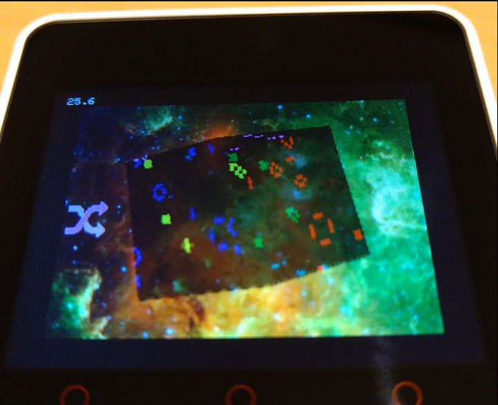

# GameOfLifeOnCube

## 概要

* 

## 操作方法

* ボタン A: 選択
* ボタン B: 決定
* ボタン C: キャンセル
* タッチ操作: キューブの回転

## 動作環境

M5Core2 でのみ動作確認しています。

## 依存ライブラリ

* [m5stack/M5Core2](https://github.com/m5stack/M5Core2)
* [lovyan03/LovyanGFX](https://github.com/lovyan03/LovyanGFX)
